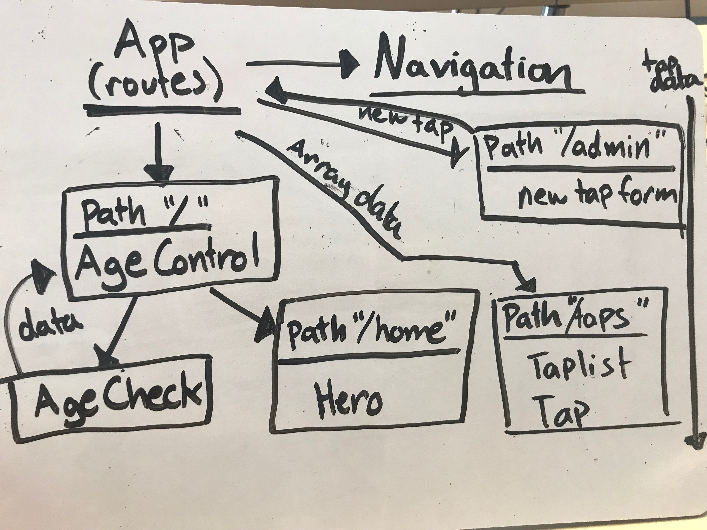

## Taproom v.2
#### Website redesign for the previous taproom project
#### Ami - 6/29/18
---
### Description
A redesign for a tap room using React routing and looping.

### Component structure

### Setup Instructions
  1. Clone repository from (https://github.com/amiraine/tap.git)
  2. navigate to tap directory
  3. run `npm install`.
  4. to view site on live development server, run `npm start`

### Technologies Used
- React
  * React router DOM

### Problems
-

### Licenses

Copyright 2018 by Ami Cooper AKA github.com/amiraine
